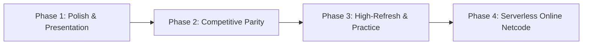

# melee-pc

**Beta, for testing only.** "melee-pc" is a working name. Online play with
rollback netcode is planned and **not implemented yet**.

A native PC port of Super Smash Bros. Melee (NTSC-U 1.02), built from
[doldecomp/melee](https://github.com/doldecomp/melee) on top of
[aurora](https://github.com/encounter/aurora) (GX/OS/PAD/DVD/CARD/THP
compatibility layer with a WebGPU backend) and SDL3. Same approach as
[dusklight](https://github.com/TwilitRealm/dusklight).

You need your own disc image. No game data ships here.

## Features

- Native Linux, Windows and Android (arm64) builds, rendered through
  Dawn/WebGPU (Vulkan, D3D12) and SDL3.
- RmlUi launcher with disc selection and SHA-1 verification against the Redump
  database before boot.
- In-game settings overlay on **F1**, with the game paused underneath.
- Internal resolution from Auto to 10x native (6400x4800).
- Post-processing shaders: area sampling, CRT scanlines, vibrant.
- 4x MSAA and anisotropic filtering up to 16x.
- Gamepad remapping, including C-stick directions, saved per device.
- Software AX audio mixer with multi-bus volume controls (Master, Music, SFX).
- Custom soundtrack streaming (`.ogg` and `.wav` in `~/.local/share/melee-pc/music/`).
- Dolphin-compatible `.gci` memory cards.
- Custom HD texture pack replacements (`~/.local/share/melee-pc/textures/`).
- "Unlock Everything" toggle (instant 26 characters, 11 secret stages, and All-Star mode).
- Hazardless stages (Frozen Pokémon Stadium in permanent neutral mode).
- Free / Unlocked pause camera (360° rotation and unlimited zoom) and Wide HUD anchoring.

## Screenshots


| | |
|---|---|
|  |  |
| Main menu | Character select |
|  |  |
| Stage select | Four-player match |
|  |  |
| Onett | F1 settings overlay |


## Development Roadmap

See the complete architectural design document at [ROADMAP.md](ROADMAP.md).



### Phase 1: Presentation Polish & System Integrations (Delivered)
- [x] **Dolphin-Format Texture Replacements**: Full folder scanning (`.dds` / `.png`) with runtime reload.
- [x] **Unlock All Toggle**: Bypass character/stage unlock grind; instant All-Star mode access.
- [x] **Multi-Bus Audio Control**: Independent volume sliders for Music (BGM) vs. Sound Effects (SFX).
- [x] **Wide HUD Anchoring**: Anchor damage percentages, stock icons, and timer to the 16:9 viewport boundaries.
- [x] **Custom Soundtrack Streaming**: User-provided `.ogg` / `.wav` files in `music/` override stage BGM.
- [x] **Free / Unlocked Pause Camera**: 360-degree rotation and unconstrained zoom for pause camera screenshots.
- [ ] **Discord Rich Presence**: Real-time rich presence displaying mode, stage, fighter, and score (deferred until API credentials available).

### Phase 2: Tournament & Competitive Parity (Upcoming)
- [ ] **Direct 1000 Hz GameCube Controller Adapter Support**: Overclocked 1 ms polling via `libusb` / `WinUSB` for official Wii U and Mayflash adapters.
- [ ] **UCF (Universal Controller Fix)**: Native 1.0 Dashback and Shield Drop angle standardization.
- [ ] **Extended Hazardless Stages**: Whispy wind toggle, Randall cloud toggle, static FoD platforms.
- [ ] **Controller Rumble & RGB Port Indicators**: Native haptics and player color LED matching.
- [ ] **2-Player Keyboard Remapping**: Split-keyboard competitive support.

### Phase 3: High-Refresh-Rate & Practice Suite
- [ ] **High-Refresh-Rate Frame Interpolation (120 Hz / 144 Hz / 240 Hz)**: Smooth motion presentation with locked 60 Hz simulation and physics.
- [ ] **Training & Practice Tools**: Hitbox/hurtbox visualizer, L-cancel flash indicators, frame advance / slow motion, training savestates.
- [ ] **Replay Recording & Playback**: Export inputs and seeds to Slippi `.slp` files with native replay player.

### Phase 4: Serverless Online Netcode (BitTorrent-Style P2P Matchmaking & Rollback)
- [ ] **BitTorrent-Style Decentralized Matchmaking (Serverless P2P)**:
  * **DHT / Kademlia Peer Discovery**: Mainline DHT peer discovery eliminating central matchmaking servers and hosting costs.
  * **Decentralized Connect Codes**: Topic/infohash-based room matchmaking.
  * **NAT Traversal & UDP Hole-Punching**: Direct P2P connectivity behind home routers.
- [ ] **Native Rollback Netcode**: Sub-millisecond state snapshotting and restoration on native MEM1 memory blocks.
- [ ] **macOS Support** (Apple Silicon / Metal).
- [ ] **RetroAchievements Integration**: Native achievement tracking.

## Status

Works end to end:

- Boot, opening movie, memory card create/load, title, attract demos.
- Main menu, VS Mode, character and stage select; human vs CPU matches play.
- 1-P Classic, Adventure, and All-Star run to completion, with results and score saved.
- Training, Stadium (Target Test, Home-Run Contest, 10-Man Melee).
- Trophy gallery, Event Match list, Icicle Mountain scrolling.
- Music, sound effects, custom soundtrack overrides, saves.
- Cheats menu: "Unlock Everything", Frozen Pokémon Stadium, Free pause camera.
- Wide 16:9 combat camera and Wide HUD anchoring.

In development: online play with rollback netcode & BitTorrent DHT peer matchmaking, 1000 Hz GameCube controller polling, UCF, practice mode hitboxes/savestates, and macOS.

## Building

Needs GCC (the game code relies on `scalar_storage_order("big-endian")`, which
only GCC implements), CMake 3.25+, Ninja, and a Vulkan driver. Aurora fetches
its own Dawn/SDL3/nod prebuilts.

```sh
cmake -B build -G Ninja
ninja -C build
```

No disc data is needed to build. The two HSD font atlases are pixel data from
the retail DOL, so instead of being committed they are read out of the disc
you supply, at boot (`src/pc/discfont.c`).

The release artifacts are produced by the same scripts CI runs, so they work
locally too. Windows cross-compiles from Linux with MinGW-w64; Android needs an
NDK (`ANDROID_NDK_HOME`) and a JDK 17.

```sh
tools/package_linux.sh      # dist/Melee-x86_64.AppImage + tarball
tools/package_windows.sh    # dist/Melee-Windows-x86_64.zip
tools/build_android.sh      # dist/Melee-Android-arm64.apk (signed release)
```

## Running

```sh
build/melee                              # open the launcher
build/melee <disc.iso|.gcm|.ciso|.rvz>
```

Only **Melee USA revision 2 (NTSC-U 1.02, GALE01)** is supported. A valid disc
path on the command line boots straight in; a missing or invalid one returns to
the launcher. Settings and the selected path live in `launcher.cfg` in SDL's
`melee-pc` preference directory (usually `~/.local/share/melee-pc`).

Verification reads the disc through nod, compressed images included, and compares
SHA-1 against the
[Redump DAT](https://github.com/libretro/libretro-database/blob/master/metadat/redump/Nintendo%20-%20GameCube.dat):
`d4e70c064cc714ba8400a849cf299dbd1aa326fc`, 1,459,978,240 bytes. It supports
progress and cancellation, and is not cached between launches. Unverified images
still play.

Keep `resources/` next to the binary when distributing. The bundled Liberation
Sans fonts are covered by `resources/FONT-LICENSE.txt`.

## Controls

Keyboard: arrows = stick, IJKL = C-stick, X = A, Z = B, C = X, V = Y, Q/E = L/R,
Tab = Z, Enter = Start, TFGH = D-pad. Gamepads work through SDL.

| | Keyboard | Gamepad |
|---|---|---|
| Navigate | Up/Down, Tab | D-pad or left stick |
| Adjust | Left/Right | D-pad left/right |
| Change tab | Left/Right on the tab strip | L/R shoulders |
| Select | Enter | A |
| Close overlay | Escape, F1 | B, Start, Back |

## Settings overlay

**F1**, or Back/Select on a gamepad, opens the overlay. The game pauses while it
is open.

- Display: fullscreen/windowed and VSync apply immediately. `MELEE_VSYNC`
  overrides the saved preference.
- Internal resolution and UI scale are sliders. UI scale covers 75% to 150%.
- Post-processing picks the presentation shader and applies immediately.
- Anti-aliasing and anisotropic filtering apply on the next launch. MSAA offers
  only off and 4x because WebGPU guarantees sample counts 1 and 4.
- Audio: master volume, mute, FPS counter, all immediate.
- Controls remaps a gamepad. Pick the port, select a GameCube button, then press
  the physical button. Escape cancels, Restore resets the port. Back cannot be
  bound since it opens the menu. Sticks and triggers remap the same way, and a
  direction accepts either a stick axis or a button.

Melee's own menu sounds play in the overlay. Bindings are stored in aurora's
per-device `.controller` files; everything else shares `launcher.cfg`.

## Environment variables

| Variable | Effect |
|---|---|
| `MELEE_SEED=<n>` | Deterministic RNG for the attract demo. |
| `MELEE_HEAP_CHECK=1` | Canaries on every heap allocation, checked each frame; aborts at the first stomp. |
| `MELEE_FPS=1` | Print frame rate once a second. |
| `MELEE_AUDIO_DUMP=<file>` | Also write the mix as raw f32 stereo 32 kHz. |
| `MELEE_WINDOW_TITLE=<t>` | Window title. |
| `--no-card` | Boot without a memory card. |
| `--dvd <image>` | Explicit form of the positional disc argument. |

Diagnostics are off by default and cost nothing when unset. They measure or
suppress only; none of them fixes anything.

| Variable | Effect |
|---|---|
| `AURORA_LOG_UNTEX=1` | Report draws that bind no texture. |
| `AURORA_SKIP_UNTEX=1` | Drop every untextured draw. |
| `AURORA_SKIP_UNTEX_VTX=n` | Drop untextured draws with exactly n vertices. |
| `AURORA_LOG_TEV=1` | Report what an untextured draw's TEV stages asked for. |
| `MELEE_MOBJ_MARK=1` | Tag draws with whether the material had a texture. |
| `MELEE_TEV_TREE=1` | Count compiled TEV stages and how many carry a texture. |
| `MELEE_TEX_ASSIGN=1` | Count tobjs assigned a texmap vs forced to null. |
| `MELEE_PS_TEXMISS=1` | Report particles that ask for a texture but resolve none. |
| `MELEE_SFX_STATS=1` | Sound-effect request/accept/reject counts. |
| `MELEE_AUDIO_STATS=1` | Per-0.5s voice census. |
| `MELEE_AUDIO_ADDR=1` | Report voice sample addresses against the ARAM bounds. |
| `MELEE_CPU_TRACE=1` | Per-CPU-player AI census every ~2s. |
| `MELEE_EF_LOG=1`, `MELEE_EF_SKIP=a-b` | Report or suppress effect ids. |

## Porting notes

Disc data stays big-endian in memory and is described with `DISC_STRUCT` and
`DISC_PTR` (see `src/pc/disc.h`). Structs mapping archive contents are byte-swapped
on access by GCC, disc pointers are 32-bit slots relocated to host addresses, and
MEM1 is mapped at `0x80000000` so those slots always fit. The whole 4 GB range is
game-addressable through `-no-pie` with text at `0x10000000`.

Bug classes that keep coming back when bringing up a new scene:

- Runtime structs have 8-byte pointers, so any hard-coded GameCube offset
  (`(u8*)gp + 0xD8`, `memzero(p, 0x74)`, padded overlay structs) has to become a
  real field or `sizeof`.
- Statics are not adjacent on x86-64. A cast to a bigger struct to reach the next
  static must name the neighbour instead.
- Bitfields are LSB-first. Unions overlaying bitfields with an integer view need
  `DISC_STRUCT` on the union and every nested struct.
- `UNK_T` is `void*`, so unnamed words are 8 bytes. Inside a union view that is a
  layout change; retype numeric ones `u32`.
- Motion-variable unions (`Fighter::mv`) have the same problem one level down: the
  game writes one view and reads another, so a pointer inside a view shifts every
  member below it. Where no position survives, move the field into `Fighter`.
- Retail `GXEnd` is empty and the decomp omits it, but aurora's `GXEnd` submits
  the draw. Every `GXBegin` needs one.
- `Mtx` is 48 bytes and `Mtx44` is 64; `MTXOrtho` and `MTXPerspective` take `Mtx44`.
- `bool` in a decomp signature usually means "int the decompiler could not name".
  Under `_Bool` every value above 1 clamps, so an index or scene id silently
  becomes 1.
- Walking an object as `void**` and indexing by GameCube word number scales by 8,
  so `p[0x14]` for byte 0x50 lands at byte 160. Index by name.
- Japanese string literals are Shift-JIS at runtime; the build passes
  `-fexec-charset=CP932`.

Three harnesses find the next batch. Validate any sweep by re-introducing one
known-true positive and checking the count moves by exactly one.

- Whole-tree warning sweep: compile every TU for real (`-Wreturn-type` is not
  emitted under `-fsyntax-only`), strip the build's `-Wno-all -Wno-extra`, pass
  `-fdiagnostics-color=never`, and add `-Warray-bounds=2 -Wstringop-overflow=2
  -Wformat-overflow=2 -Wbool-operation`.
- `python3 tools/lint_sweep.py` compiles every game TU with `-m32 -DLINT`, which
  turns `ASSERT_SIZE` and `ASSERT_OFFSET` into real checks against the GameCube
  ABI. A failure means the struct reconstruction is wrong, not the port.
- `python3 tools/compile_check.py <files|dirs>` syntax-checks with the build's
  exact flags. Fast, so use it before a full build.

For "does this union view still alias on LP64", build one probe TU of the real
headers twice with the project's flags, native and `-m32`, then diff member
offsets and sizes out of DWARF (`gdb -batch -ex 'ptype /o T'`). Compare byte-range
intersections, not start offsets.

## Tools

- `tools/run.sh <disc>` runs under gdb and dumps all threads on a crash.
- `tools/demo_run.sh <seed> [secs]` enters the attract demo and reports survival
  or crash frames; `tools/demo_sweep.sh <seeds...>` batches it.
- `tools/devctl.py key|hold|shot` drives and captures the game window under X11.
- `tools/run_dbg.sh <disc>` adds a FIFO/PAD state dump on interrupt.

`import -window` can keep returning the last composited frame under Xwayland while
the game presents normally, which looks like a freeze and is not one. `devctl.py
shot` detects two identical captures and nudges the window; when a screenshot and
a backtrace disagree, believe the backtrace.

## Contributing & Coding Style

Please refer to [CODING_STYLE.md](CODING_STYLE.md) for architectural guidelines,
formatting standards, 64-bit portability rules, and verification procedures. Run
`python3 tools/check_style.py` before opening pull requests.

## Layout

- `src/melee`, `src/sysdolphin` - game code from the decomp (upstream commit in
  `src/UPSTREAM_COMMIT`), adapted to the PC data model.
- `src/pc` - platform layer: main, OS/VI/GX glue, keyboard, audio mixer, THP,
  vertex-array sizing.
- `extern/aurora` - vendored aurora with local changes.

## License

Three situations, spelled out in [LICENSE.md](LICENSE.md): the decompiled
game code in `src/melee` and `src/sysdolphin` is **not licensed** and remains
the property of its copyright holders; the port code in `src/pc`, `tools`,
`platforms`, `cmake` and `.github` is **GPL-3.0-or-later** ([COPYING](COPYING));
bundled third-party components keep their own licenses. Because the game code
cannot be relicensed, the repository as a whole is not distributable under the
GPL. No game assets are in this repository.
