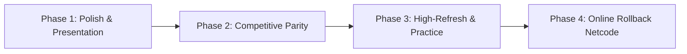

# Melee-PC Development Roadmap

Scope and sequencing for **Melee-PC**, a native source-level PC port of *Super
Smash Bros. Melee* (NTSC-U 1.02) on the **Aurora** engine (Dawn/WebGPU, SDL3)
and modern C11/C++20.

> **This file carries no feature status.** What is done, partly done or not
> started lives in one place, the status table in
> [README.md](README.md#status). Everything below is the plan: what each phase
> covers and why it is ordered that way. Items stay listed after they ship so
> the design rationale does not get deleted with them.

---

## Vision & Core Tenets

1. **Native Performance & Frame Pacing**: Eliminate emulation overhead, runtime JIT compilation, and shader stutter using ahead-of-time pipeline caching and zero-copy asset streaming.
2. **Deterministic 60 Hz Simulation**: The underlying physics, hitlag, RNG, damage calculation, blast zones, and combat logic must stay bit-identical to the GameCube NTSC-U 1.02 DOL.
3. **Modern Presentation**: Widescreen (16:9 and window-aspect ultrawide), high-DPI UI scaling, internal resolution up to 10x native (6400x4800), and high-refresh presentation.
4. **Community & Competitive Parity**: Target competitive tournament standards (UCF, 1000 Hz polling, hazardless stages, low input latency) and modding ecosystems (Dolphin-format HD textures, custom soundtracks, code mods).

---

## Development Milestones

---

### Phase 1: Presentation Polish & System Integrations

Focus: Refine visual presentation, audio balance, and desktop integration.

- **Dolphin-Format Texture Replacements**: Folder scanning (`.dds` / `.png`) with runtime reload.
- **Unlock All Toggle**: Bypass character/stage unlock grind; unlock All-Star mode.
- **Multi-Bus Audio Control**: Independent volume sliders for Music (BGM) vs. Sound Effects (SFX).
- **Wide HUD Anchoring**: Anchor damage percentages, stock icons, and timer to the 16:9 viewport boundaries (on/off toggle).
- **Discord Rich Presence**: Real-time rich presence displaying current mode, stage name, fighter played, and stock/time score. Needs API credentials before it can be built.
- **Custom Soundtrack Override**: User-provided `.ogg` / `.wav` files in a `music/` folder replace stage BGM.
- **Free / Unlocked Pause Camera**: Remove rotation and boundary constraints on the pause camera for screenshots.

---

### Phase 2: Tournament & Competitive Parity

Focus: Input precision, hardware adapters, and tournament rule compliance.

- **Direct 1000 Hz GameCube Controller Adapter Support**:
  * Direct access to official Nintendo Wii U/Switch GC Adapters and Mayflash (Wii U mode), bypassing the OS gamepad translation layer so the game sees raw 8-bit stick and trigger values.
  * 1 ms (1000 Hz) polling off the dedicated input thread.
- **UCF (Universal Controller Fix)**:
  * Dashback Fix: Eliminate controller polling variance on dash turns.
  * Shield Drop Fix: Standardize diagonal shield drop input thresholds on analog gates.
- **Extended Hazardless Stages**:
  * Dream Land 64 (Whispy Woods wind disabled).
  * Yoshi's Story (Shy Guys fly-bys disabled; Randall the Cloud togglable).
  * Fountain of Dreams (fixed platform heights).
- **Controller Haptics & Visuals**:
  * Rumble for SDL3 gamepads and GameCube adapter motors, driven from the game's own `PADControlMotor` calls.
  * Controller lightbar / RGB LED synchronization with player port colors (P1 Red, P2 Blue, P3 Yellow, P4 Green).
- **2-Player Keyboard Remapping**:
  * Configurable in-game keyboard remapping.
  * Support for two players sharing a single keyboard (e.g. WASD + JKL vs. Numpad + Arrows).

---

### Phase 3: High-Refresh-Rate Interpolation & Training Suite

Focus: Cutting-edge display performance and competitive practice tools (UnclePunch-inspired).

- **High-Refresh-Rate Frame Interpolation (120 Hz / 144 Hz / 240 Hz)**:
  * Keep gameplay simulation, physics, hitlag, and inputs locked at 60 Hz.
  * Interpolate camera matrices and fighter joint hierarchies (`HSD_JObj`) between 60 Hz ticks for smooth presentation on modern gaming monitors.
- **Training & Practice Tools**:
  * **Hitbox & Hurtbox Visualizer**: Real-time rendering of attack hitboxes (red), grab boxes (yellow), hurtboxes (blue), and Environmental Collision Boxes (ECB) using Aurora's GX geometry layer.
  * **L-Cancel Flash Indicator**: Visual feedback on aerial landings (green flash on successful L-cancel, red flash on missed L-cancel).
  * **Frame Advance & Slow Motion**: Dedicated hotkeys to advance simulation frame-by-frame or run at 50% / 25% speed.
  * **Savestates in Training Mode**: Instant save and load slots to drill specific recovery or combo situations.
- **Replay Recording & Playback**:
  * Record match inputs, RNG seeds, and metadata to Slippi `.slp` files.
  * Built-in replay playback and compatibility with Slippi Lab.

---

### Phase 4: Serverless Online Netcode (BitTorrent-Style P2P Matchmaking & Rollback)

Focus: Zero-delay online play with completely decentralized, serverless peer matchmaking.

- **BitTorrent-Style Decentralized Matchmaking (Serverless P2P)**:
  * **DHT / Kademlia Peer Discovery**: Utilize a Distributed Hash Table (DHT, similar to BitTorrent's Mainline DHT or libp2p) for matchmaking and peer discovery—eliminating the need for central matchmaking servers, ongoing hosting costs, or single points of failure.
  * **Decentralized Connect Codes & Matchmaking Topics**: Direct connect codes (e.g. `ABC#123`) or unranked matchmaking pools hash into 160-bit DHT infohashes; players seeking opponents announce themselves under the topic and discover peers directly.
  * **NAT Traversal & UDP Hole-Punching**: Direct peer-to-peer UDP hole-punching to connect players behind home routers and NATs without relay servers.
  * **Community Resilience & Longevity**: Zero backend infrastructure means the online mode can never be shut down or abandoned.
- **Native Rollback Netcode**:
  * Implementation of GGPO / Slippi rollback protocol running directly on native C11/C++20 game memory.
  * Instantaneous state snapshotting and restoration using native MEM1 memory blocks (sub-millisecond rollbacks with no emulator translation overhead).
  * Low-jitter adaptive input delay and frame sync.
- **RetroAchievements Integration**:
  * Native achievement tracking for Single Player, Event Matches, Target Tests, and Home-Run Contest.

---

## Feedback & Community

Discussions, bug reports, and feature proposals are welcome on [GitHub Issues](https://github.com/999sian/melee-pc/issues) and [Discord](https://discord.gg/aurt34svq). The current feature-status table is in the [README](README.md#status).
